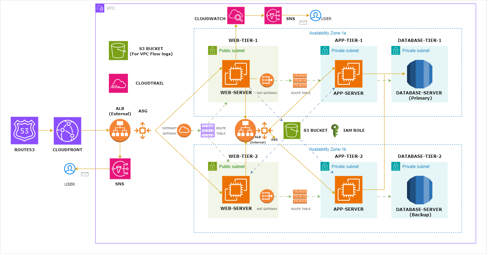

# Multi-tier-architecture-using-terraform

Deploy a scalable and resilient multi-tier architecture on AWS using Terraform.

# 📌What is Terraform?

- Terraform is an open-source Infrastructure as Code (IaC) tool that allows you to define and provision cloud infrastructure using declarative configuration files.
- It supports multiple cloud providers and helps automate the setup, management, and versioning of infrastructure efficiently.

# 🚀 Multi-Tier Architecture Overview

A 3-tier architecture consists of three main layers: a web tier (presentation layer), an application tier (logic layer), and a database tier (data layer). This structure enables modular development, independent scaling, and better fault isolation.

**Web Tier**:
This tier handles all incoming HTTP/S requests from users. It typically includes web servers like Nginx or Apache and load balancers to distribute traffic evenly across multiple instances. It ensures a responsive and accessible user interface.

**Application Tier**:
This tier processes the core business logic and handles interactions between the web and database layers. Application servers run the backend code, such as Java, Node.js, or Python, and are horizontally scalable to handle dynamic workloads.

**Database Tier**:
The database tier is responsible for storing, retrieving, and managing persistent application data. It uses relational or NoSQL databases like MySQL, PostgreSQL, or MongoDB—often managed via services like Amazon RDS for scalability and reliability.

# 📌 Architecture Diagram



# 🚦 Getting Started

# Prerequisites

Before you get started, make sure you have the following prerequisites in place:

+ Terraform installed.
```
    sudo apt-get update && sudo apt-get install -y gnupg software-properties-common

    wget -O- https://apt.releases.hashicorp.com/gpg | \
    gpg --dearmor | \
    sudo tee /usr/share/keyrings/hashicorp-archive-keyring.gpg > /dev/null

    echo "deb [signed-by=/usr/share/keyrings/hashicorp-archive-keyring.gpg] \
    https://apt.releases.hashicorp.com $(lsb_release -cs) main" | \
    sudo tee /etc/apt/sources.list.d/hashicorp.list

    sudo apt update

    sudo apt-get install terraform -y
```

+ AWSCLI and IAM credentials configured.
```
curl "https://awscli.amazonaws.com/awscli-exe-linux-x86_64.zip" -o "awscliv2.zip"
sudo apt install unzip
unzip awscliv2.zip
sudo ./aws/install -i /usr/local/aws-cli -b /usr/local/bin --update
aws configure
```


# 📋 Table of Contents

+ [Features](https://github.com/Smrutiprusty/Multi-tier-architecture-using-terraform/edit/main/README.md#-features)
+ [Web Tier](https://github.com/Smrutiprusty/Multi-tier-architecture-using-terraform/blob/main/README.md#-web-tier)
+ [Application Tier](https://github.com/Smrutiprusty/Multi-tier-architecture-using-terraform/blob/main/README.md#-application-tier)
+ [Database Tier](https://github.com/Smrutiprusty/Multi-tier-architecture-using-terraform/blob/main/README.md#-database-tier)
+ [Terraform Configuration](https://github.com/Smrutiprusty/Multi-tier-architecture-using-terraform/blob/main/README.md#-terraform-configuration)
+ [Deployment](https://github.com/Smrutiprusty/Multi-tier-architecture-using-terraform/blob/main/README.md#-deployment)
+ [Usage](https://github.com/Smrutiprusty/Multi-tier-architecture-using-terraform/blob/main/README.md#-usage)
+ [Contributing](https://github.com/Smrutiprusty/Multi-tier-architecture-using-terraform/blob/main/README.md#-contributing)
+ [License](https://github.com/Smrutiprusty/Multi-tier-architecture-using-terraform/blob/main/README.md#-license)
  
# ✨ Features

**High Availability**: The architecture is designed for fault tolerance and redundancy.

**Scalability**: Easily scale the web and application tiers to handle varying workloads.

**Security**: Security groups and network ACLs are configured to ensure a secure environment.

# 🌟 Web Tier

The Web Tier is the entry point for incoming user requests. It typically includes:

**Load Balancer**: Distributes traffic across multiple web servers.

**Auto Scaling**: Automatically adjusts the number of web servers based on traffic.

**Security Groups**: Controls incoming and outgoing traffic to the web servers.

# Web Tier Configuration
+ Launch Template Configuration
+ Load Balancer Configuration
+ Auto Scaling Configuration
+ Security Group Configuration of Load balancer
+ Security Group Configuration of Auto Scaling Group

# 🚀 Application Tier

The Application Tier hosts the application servers responsible for running business logic and interacting with the database tier. Key components include:

**Application Servers**: These run your application code and can be horizontally scaled.

**Load Balancer**: Distributes traffic to the application servers.

**Auto Scaling**: Automatically adjusts the number of web servers based on traffic.

**Security Groups**: Controls incoming and outgoing traffic to the application servers.

# Application Tier Configuration

+ Launch Template Configuration
+ Load Balancer Configuration
+ Auto Scaling Configuration
+ Security Group Configuration of Load balancer
+ Security Group Configuration of Auto Scaling Group
  
# 💽 Database Tier

The Database Tier stores and manages our application data. We use Amazon RDS for a managed database service. Key components include:

+ Amazon RDS: A managed database service for MySQL/PostgreSQL/SQL Server databases.
+ Security Groups: Control incoming and outgoing traffic to the database.
  
# Database Tier Configuration

+ DB Subnet group Configuration
+ Amazon RDS Configuration
+ Security Group Configuration
  

# 🔧 Terraform Configuration

The Terraform configuration for this project is organized into different sections and resources to create the necessary AWS infrastructure components. Key resources include:

+ Virtual Private Cloud (VPC)
+ Subnets, IGW, EIP, NAT and Route Tables
+ Security Groups and Network ACLs
+ Load Balancers
+ Auto Scaling Groups
+ RDS Database Instances
  
# 🚀 Deployment

Follow these steps to deploy the architecture:

1.Clone the repository:

```bash
git clone https://github.com/Venkat3699/3-tier-architectute-terraform.git
```


2.Make changes as per your needs.

3.Initialize Terraform and apply the configuration:

```hcl
terraform init
terraform fmt
terraform validate
terraform plan
terraform apply
terraform destroy
```

4.Review the changes and confirm.

# 💼 Usage

**Scaling**

To scale the Web or Application Tier, use Auto Scaling configurations provided in the respective Terraform files. Adjust the desired capacity to match your scaling requirements.

**Database Management**

Access the Amazon RDS instance in the Database Tier to manage your data.

**Load Balancing**

Configure the load balancer in the Web and Application Tiers to distribute traffic evenly.

**Security Considerations**

Review and customize the security groups and network ACLs to meet your specific security requirements.

# 🤝 Contributing
Contributions are Welcome! Make a pull request or open an issue if you find any.

# 📄 License

This project is licensed under the MIT License.
